# 🏎️ F1 신차 추천 챗봇

<div align="center">
  
  
  [](https://python.org)
  [](https://streamlit.io)
  [](https://openai.com)
  [](LICENSE)
</div>

---

**F1 레이싱의 스피드와 열정을 담은 RAG 기반 AI 자동차 추천 챗봇** 🏁

**RAG(Retrieval-Augmented Generation) 기술**과 **LangChain**을 활용하여 사용자의 요구사항을 정확히 분석하고, F1 테마의 역동적인 UI와 함께 데이터 기반의 개인화된 자동차 상담 서비스를 제공합니다.

## 주요 기능

###  **RAG 기반 스마트 AI 추천 시스템**
- **RAG(Retrieval-Augmented Generation)** 기술로 실시간 차량 데이터 검색 및 생성
- **LangChain LCEL(LangChain Expression Language)** 체인으로 구축된 고성능 파이프라인
- **OpenAI GPT-4o-mini** 기반 지능형 차량 분석 및 추천
- 사용자 요구사항을 실시간으로 학습하여 **3순위까지** 정확한 추천
- 예산, 용도, 선호도를 종합 분석한 **개인 맞춤형 상담**

###  **몰입감 넘치는 F1 테마 UI**
- **레이싱 테마** 인터페이스로 역동적인 사용자 경험
- **F1 배경음악**으로 실제 레이싱 트랙에 있는 듯한 분위기
- **커스텀 배경 이미지**와 F1 로고로 브랜딩 완성

###  **지능형 대화 시스템**
- 자연어 처리를 통한 **직관적인 대화**
- **사용자별 채팅 기록 저장** 및 컨텍스트 유지
- 기존 사용자 **자동 인식** 및 이전 대화 복원

###  **RAG 기반 데이터 검색 및 추천**
- **벡터화된 차량 데이터베이스**에서 실시간 유사도 검색
- **LangChain Document Processing**으로 구조화된 차량 정보 처리
- **실시간 비교 분석** 및 **상세 추천 근거** 제시
- **컨텍스트 유지**를 통한 연속적인 대화형 추천

## 사용 환경

### Visual Studio Code

## 빠른 시작

### 1️⃣ 사전 요구사항
```bash
Python 3.8 이상
OpenAI API 키
```

### 2️⃣ 설치 및 설정
```bash
# 저장소 클론
git clone https://github.com/crayonjunjjang/recommand_car_chatbot.git
cd 저장된 파일 경로

# 가상환경 생성 (Anaconda Prompt)
conda create -n py312 python=3.12

#가상환경 연동
conda activate py312
cd 저장된 파일 경로  

# 패키지 설치
pip install -r requirements.txt
```

### 3️⃣ 환경 변수 설정
`.env` 파일을 생성하고 OpenAI API 키를 설정하세요:
```env
OPENAI_API_KEY=your_openai_api_key_here
```

### 4️⃣ 실행
```bash
streamlit run app.py
```
브라우저에서 `http://localhost:8501`로 접속하세요! 🎉

## 📂 프로젝트 구조

```
f1-car-chatbot/
├── app.py                 #  메인 애플리케이션
├── data/
│   └── car.json           #  자동차 데이터베이스
├── requirements.txt       #  패키지 의존성
├── .env                   #  환경 변수 (생성 필요)
├── chat_history.csv       #  채팅 기록 (자동 생성)
├── f1.mp3                 #  F1 배경음악
├── f1.jpg                 #  F1 배경 이미지
└── README.md              #  프로젝트 문서
```

## 기술 스택

| 분야 | 기술 |
|------|------|
| **Frontend** |  |
| **RAG/LLM** |    |
| **Data** |   |
| **Language** |  |

## 사용법

###  **Step 1: 닉네임 입력**
첫 방문 시 원하는 닉네임을 입력하세요. 기존 사용자는 자동으로 이전 대화를 불러옵니다.

###  **Step 2: 자연스러운 대화**
채팅창에 원하는 차량 조건을 자유롭게 입력하세요:

```
✅ "전기차 추천해주세요"
✅ "5000만원 이하 가족용 SUV"  
✅ "출퇴근용으로 연비 좋은 차"
✅ "디자인 예쁜 소형차 찾고 있어요"
```

###  **Step 3: RAG 기반 AI 추천 확인**
- **RAG 시스템**이 차량 데이터베이스에서 관련 정보를 실시간 검색
- **LangChain 파이프라인**을 통한 **3순위까지** 맞춤 추천
- **상세한 추천 근거** 및 차량 정보 (가격, 연비, 사양 등)
- **추가 질문**으로 더 정확한 추천 가능

## 자동차 데이터 형식

`data/car.json` 파일의 데이터 구조:

```json
{
  "model_name": "더 뉴 아이오닉 6",
  "brand": "현대",
  "price": 48560000,
  "fuel_type": "전기",
  "car_type": "세단",
  "range_km": 562,
  "fuel_efficiency": {
    "value": 6.3,
    "unit": "km/kWh"
  },
  "seats": 5,
  "available_colors": ["세레니티 화이트", "트랜스미션 블루 펄"],
  "subsidy": true,
  "short_desc": "고급스러운 디자인과 500km 이상 주행 가능한 전기 세단"
}
```

##  커스터마이징

###  **배경음악 변경**
`f1.mp3` 파일을 원하는 음악으로 교체하세요.

###  **배경 이미지 변경**  
`f1.jpg` 파일을 원하는 이미지로 교체하세요.

###  **차량 데이터 추가**
`data/car.json`에 새로운 차량 정보를 추가하세요.

## RAG 아키텍처 및 기술적 특징

### **RAG 파이프라인**

```mermaid
graph LR
    A[사용자 입력] --> B[LangChain LCEL]
    B --> C[차량 데이터 검색]
    C --> D[GPT-4o-mini 생성]
    D --> E[개인화된 추천]
```


### **핵심 기술 구현**
- **Document Processing**: 차량 정보를 구조화된 문서로 변환
- **Retrieval System**: 사용자 쿼리와 관련된 차량 데이터 실시간 검색
- **Context Integration**: 이전 대화 맥락과 검색된 데이터 통합
- **Generation Pipeline**: LangChain 체인을 통한 자연스러운 응답 생성

### 요구사항 파일

`requirements.txt`:
```txt
streamlit>=1.28.0
openai>=1.0.0
langchain-openai>=0.1.0
langchain-core>=0.2.0
pandas>=2.0.0
python-dotenv>=1.0.0
```

## 문제 해결

### 자주 발생하는 문제들:

**Q: OpenAI API 키 오류가 발생해요**
- `.env` 파일이 올바른 위치에 있는지 확인
- API 키가 정확한지 확인
- OpenAI 계정에 충분한 크레딧이 있는지 확인

**Q: 채팅 기록이 저장되지 않아요**
- 프로젝트 폴더에 쓰기 권한이 있는지 확인
- `chat_history.csv` 파일 생성 권한 확인